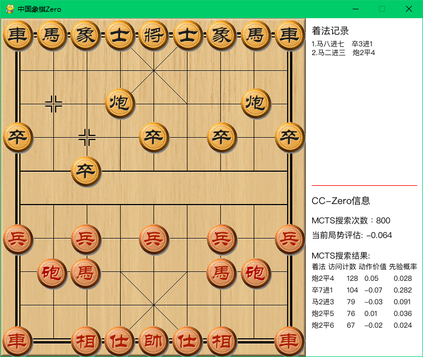

# 中国象棋Zero（CCZero）

基于AlphaZero算法的中国象棋AI训练系统。



## 环境要求

```bash
pip install -r requirements.txt
```

* Python 3.10.11
* CUDA: 11.8
* cuDNN: 8.9.0


## 1. 与AI对弈

使用训练好的模型与AI下棋：

```bash
# GUI界面对弈
python cchess_alphazero/run.py play --gpu 0

# 命令行界面对弈
python cchess_alphazero/run.py play --cli --type mini --gpu 0

# AI先手
python cchess_alphazero/run.py play --ai-move-first --type mini --gpu 0
```

## 2. 自我对弈训练

### 步骤1：自我对弈生成训练数据

```bash
python cchess_alphazero/run.py self --gpu 0
```

自我对弈会在 `data/play_data` 目录下生成对弈记录。

### 步骤2：训练模型

```bash
python cchess_alphazero/run.py opt --type mini --gpu 0
```

训练会使用自我对弈的数据优化模型，新模型保存在 `data/model` 目录。

### 步骤3：评估模型性能

```bash
# 快速评估
python cchess_alphazero/run.py eval --type mini --gpu 0

# 标准评估
python cchess_alphazero/run.py eval --type normal --gpu 0
```

评估结果示例：
```
Evaluate over, next generation win 0.5/1 = 50.00%
红    黑    胜    平    负
新    旧    0     1     0
旧    新    0     0     1
```

### 步骤4：循环训练

重复步骤1-3，不断提升模型性能：

```bash
# 完整训练循环
python cchess_alphazero/run.py self --type mini --gpu 0
python cchess_alphazero/run.py opt --type mini --cpu
python cchess_alphazero/run.py eval --type mini --gpu 0
```

### 步骤5：自动进化训练（推荐）

使用新的 `evolve` 命令，自动循环执行训练过程：

```bash
# 无限循环自动训练（推荐，混合模式）
python cchess_alphazero/run.py evolve --type mini

# 限制迭代次数
python cchess_alphazero/run.py evolve --type mini --max-iterations 10

# 跳过评估步骤（加快训练速度）
python cchess_alphazero/run.py evolve --type mini --skip-eval

# 标准配置自动训练
python cchess_alphazero/run.py evolve --type normal

# 全GPU训练（仅在GPU环境完全稳定时）
python cchess_alphazero/run.py evolve --type mini --gpu 0
```

**evolve命令特点：**
- **🚀 智能混合训练**：self-play用GPU（快速），optimize用CPU（稳定）
- **🛡️ 避免GPU错误**：训练阶段使用CPU，避免CUBLAS错误
- 自动循环执行：self-play → optimize → evaluate → self-play → ...
- 智能文件管理：避免生成多余训练文件
- 支持用户中断（Ctrl+C）优雅停止
- 详细的进度日志和时间统计
- 可配置最大迭代次数
- 可选择跳过评估步骤

## 3. 配置说明

### 配置类型

* `--type mini`: 快速测试配置
  - 游戏数量少，模拟次数少
  - 适合功能验证和快速测试

* `--type normal`: 标准配置
  - 平衡的性能和速度
  - 推荐用于正式训练

* `--type distribute`: 分布式配置
  - 高性能配置，需要强大硬件
  - 适合多机训练环境

### 常用参数

* `--gpu 0`: 指定GPU设备（不指定则使用混合模式）
* `--cli`: 使用命令行界面（对弈时）
* `--ai-move-first`: AI先手（对弈时）
* `--elo`: 计算ELO评分（评估时）
* `--max-iterations N`: 限制evolve命令的最大迭代次数
* `--skip-eval`: 在evolve命令中跳过评估步骤

**重要**: evolve命令现在**默认使用混合训练模式**（self-play用GPU，optimize用CPU），兼顾速度与稳定性。

## 4. 测试评估功能

运行测试脚本验证评估功能：

```bash
python test_evaluation.py
```

测试通过后即可正常使用评估功能。
