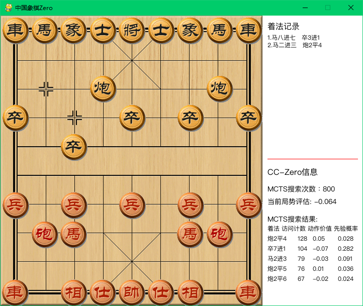

# 中国象棋Zero（CCZero）

On 20250427,
now it's able to run on Windows, but rather slow.



## About

Chinese Chess reinforcement learning by [AlphaZero](https://arxiv.org/abs/1712.01815) methods.

This project is based on these main resources:
1. DeepMind's Oct 19th publication: [Mastering the Game of Go without Human Knowledge](https://www.nature.com/articles/nature24270.epdf?author_access_token=VJXbVjaSHxFoctQQ4p2k4tRgN0jAjWel9jnR3ZoTv0PVW4gB86EEpGqTRDtpIz-2rmo8-KG06gqVobU5NSCFeHILHcVFUeMsbvwS-lxjqQGg98faovwjxeTUgZAUMnRQ).
2. The **great** Reversi/Chess/Chinese chess development of the DeepMind ideas that @mokemokechicken/@Akababa/@TDteach did in their repo: https://github.com/mokemokechicken/reversi-alpha-zero, https://github.com/Akababa/Chess-Zero, https://github.com/TDteach/AlphaZero_ChineseChess
3. A Chinese chess engine with gui: https://github.com/mm12432/MyChess


## Help to train

In order to build a strong chinese chess AI following the same type of techniques as AlphaZero, we need to do this with a distributed project, as it requires a huge amount of computations.

If you want to join us to build the best chinese chess AI in the world:

* For instructions, see [wiki](https://github.com/NeymarL/ChineseChess-AlphaZero/wiki)
* For live status, see https://cczero.org


## 快速开始

### 测试评估功能

如果你想快速验证评估功能是否正常工作：

```bash
# 1. 安装依赖
pip install -r requirements.txt

# 2. 运行评估功能测试
python test_evaluation.py

# 3. 如果所有测试通过，运行快速评估
python cchess_alphazero/run.py eval --type mini --gpu 0
```

### 基本使用流程

```bash
# 1. 与AI对弈（需要预训练模型）
python cchess_alphazero/run.py play --type mini --gpu 0

# 2. 自我对弈生成训练数据
python cchess_alphazero/run.py self --type mini --gpu 0

# 3. 训练模型
python cchess_alphazero/run.py opt --type mini --gpu 0

# 4. 评估模型性能
python cchess_alphazero/run.py eval --type mini --gpu 0
```

## Environment

check requirements.txt

* Python 3.7.9
* CUDA: 10.0
* cuDNN 7.6.5 for CUDA 10.0

## Modules

### Reinforcement Learning

This AlphaZero implementation consists of two workers: `self` and  `opt`.

* `self` is Self-Play to generate training data by self-play using BestModel.
* `opt` is Trainer to train model, and generate new models.

For the sake of faster training, another two workers are involved:

* `sl` is Supervised learning to train data crawled from the Internet.
* `eval` is Evaluator to evaluate the NextGenerationModel with the current BestModel.

### Built-in GUI

Requirement: pygame

```bash
python cchess_alphazero/run.py play
```

**Screenshots**


You can choose different board/piece styles and sides, see [play with human](#play-with-human).


## 完整训练流程

要从头开始训练一个强大的中国象棋AI模型，可以按照以下步骤进行：

### 1. 环境准备

确保你已经安装了所有必要的依赖：

```bash
pip install -r requirements.txt
```

### 2. 监督学习预训练（可选但推荐）

使用人类棋手的对局数据对模型进行预训练，这可以加速后续的强化学习过程：

```bash
# 使用标准数据集
python cchess_alphazero/run.py sl --gpu '0'

# 或使用onegreen网站的数据
python cchess_alphazero/run.py sl --onegreen --gpu '0'
```

监督学习完成后，会在`data/model`目录下生成`sl-best-model`文件。

### 3. 自我对弈生成训练数据

让AI通过与自己对弈来生成训练数据：

```bash
# 使用监督学习的模型作为起点
cp data/model/sl-best-model_weight.h5 data/model/model_best_weight.h5
cp data/model/sl-best-model_config.json data/model/model_best_config.json

# 开始自我对弈
python cchess_alphazero/run.py self --gpu '0'
```

自我对弈会在`data/play_data`目录下生成对弈记录。

### 4. 优化模型

使用自我对弈生成的数据来训练和优化模型：

```bash
python cchess_alphazero/run.py opt --gpu '0'
```

每个训练周期后，新的最佳模型会保存在`data/model`目录下。

### 5. 评估模型

评估新训练的模型与当前最佳模型的性能：

```bash
# 快速评估（推荐用于测试）
python cchess_alphazero/run.py eval --type mini --gpu '0'

# 标准评估（用于正式评估）
python cchess_alphazero/run.py eval --type normal --gpu '0'

# 分布式评估（用于多机环境）
python cchess_alphazero/run.py eval --type distribute --gpu '0'

# 计算ELO评分
python cchess_alphazero/run.py eval --elo --gpu '0'
```

评估结果会显示新模型与基准模型的胜负统计和胜率。如果新模型表现更好，它将成为新的最佳模型。

### 6. 迭代训练

重复步骤3-5，不断迭代提升模型性能：

```bash
# 循环执行
python cchess_alphazero/run.py self --type mini --gpu '0'
python cchess_alphazero/run.py opt --type mini --gpu '0'
python cchess_alphazero/run.py eval --type mini --gpu '0'
```

### 7. 分布式训练（可选）

如果你有多台机器，可以使用分布式训练加速：

```bash
# 在多台机器上运行
python cchess_alphazero/run.py --type distribute --distributed self
```

### 8. 测试训练效果

随时可以通过与模型对弈来测试其性能：

```bash
# 使用GUI界面
python cchess_alphazero/run.py play --gpu '0'

# 或使用命令行界面
python cchess_alphazero/run.py play --cli --gpu '0'
```

### 训练参数调整

为了获得更好的训练效果，可以调整以下参数：

1. **配置文件选择**：
   - `--type mini`：使用较小的配置进行快速测试
   - `--type normal`：使用标准配置进行正式训练
   - `--type distribute`：使用分布式配置进行多机训练

2. **MCTS参数**：
   - 在`configs`目录下的配置文件中调整`simulation_num_per_move`增加搜索深度
   - 调整`c_puct`参数平衡探索与利用

3. **模型参数**：
   - 调整`res_layer_num`增加网络深度
   - 调整`cnn_filter_num`增加网络宽度

4. **训练参数**：
   - 调整`batch_size`加速训练（需要足够的GPU内存）
   - 调整学习率调度`lr_schedules`优化训练过程

完整训练一个强大的模型可能需要数天到数周的时间，取决于你的硬件性能和训练参数设置。

## How to use

### Setup

### install libraries
```bash
pip install -r requirements.txt
```

If you want to use CPU only, replace `tensorflow-gpu` with `tensorflow` in `requirements.txt`.

Make sure Keras is using Tensorflow and you have Python 3.6.3+.

### Configuration

**PlayDataConfig**

* `nb_game_in_file, max_file_num`: The max game number of training data is `nb_game_in_file * max_file_num`.

**PlayConfig, PlayWithHumanConfig**

* `simulation_num_per_move` : MCTS number per move.
* `c_puct`: balance parameter of value network and policy network in MCTS.
* `search_threads`: balance parameter of speed and accuracy in MCTS.
* `dirichlet_alpha`: random parameter in self-play.

### Full Usage

```
usage: run.py [-h] [--new] [--type TYPE] [--total-step TOTAL_STEP]
              [--ai-move-first] [--cli] [--gpu GPU] [--onegreen] [--skip SKIP]
              [--ucci] [--piece-style {WOOD,POLISH,DELICATE}]
              [--bg-style {CANVAS,DROPS,GREEN,QIANHONG,SHEET,SKELETON,WHITE,WOOD}]
              [--random {none,small,medium,large}] [--distributed] [--elo]
              {self,opt,eval,play,eval,sl,ob}

positional arguments:
  {self,opt,eval,play,eval,sl,ob}
                        what to do

optional arguments:
  -h, --help            show this help message and exit
  --new                 run from new best model
  --type TYPE           配置类型: mini(快速测试), normal(标准), distribute(分布式)
  --total-step TOTAL_STEP
                        set TrainerConfig.start_total_steps
  --ai-move-first       set human or AI move first
  --cli                 play with AI with CLI, default with GUI
  --gpu GPU             指定GPU设备，例如 '0' 或 '0,1'
  --onegreen            train sl work with onegreen data
  --skip SKIP           skip games
  --ucci                play with ucci engine instead of self play
  --piece-style {WOOD,POLISH,DELICATE}
                        choose a style of piece
  --bg-style {CANVAS,DROPS,GREEN,QIANHONG,SHEET,SKELETON,WHITE,WOOD}
                        choose a style of board
  --random {none,small,medium,large}
                        choose a style of randomness
  --distributed         whether upload/download file from remote server
  --elo                 计算ELO评分（仅用于eval命令）
```

**配置类型说明：**

* `--type mini`: 使用mini配置，适合快速测试和开发
  - 游戏数量少，模拟次数少
  - 进程数少，资源占用低
  - 适合验证功能是否正常

* `--type normal`: 使用标准配置，适合正式训练和评估
  - 平衡的游戏数量和模拟次数
  - 适中的进程数和资源占用
  - 推荐用于单机训练

* `--type distribute`: 使用分布式配置，适合多机环境
  - 大量的游戏数量和模拟次数
  - 高进程数，需要强大的硬件支持
  - 适合分布式训练和正式评估

### Self-Play

```
python cchess_alphazero/run.py self
```

When executed, self-play will start using BestModel. If the BestModel does not exist, new random model will be created and become BestModel. Self-play records will store in `data/play_record` and BestMode will store in `data/model`.

options

* `--new`: create new BestModel
* `--type mini`: use mini config, (see `cchess_alphazero/configs/mini.py`)
* `--gpu '1'`: specify which gpu to use
* `--ucci`: whether to play with ucci engine (rather than self play, see `cchess_alphazero/worker/play_with_ucci_engine.py`)
* `--distributed`: run self play in distributed mode which means it will upload the play data to the remote server and download latest model from it

**Note1**: To help training, you should run `python cchess_alphazero/run.py --type distribute --distributed self` (and do not change the configuration file `configs/distribute.py`), for more info, see [wiki](https://github.com/NeymarL/ChineseChess-AlphaZero/wiki/For-Developers).

**Note2**: If you want to view the self-play records in GUI, see [wiki](https://github.com/NeymarL/ChineseChess-AlphaZero/wiki/View-self-play-games-in-GUI).

### Trainer

```
python cchess_alphazero/run.py opt
```

When executed, Training will start. The current BestModel will be loaded. Trained model will be saved every epoch as new BestModel.

options

* `--type mini`: use mini config, (see `cchess_alphazero/configs/mini.py`)
* `--total-step TOTAL_STEP`: specify total step(mini-batch) numbers. The total step affects learning rate of training.
* `--gpu '0'`: specify which gpu to use

**View training log in Tensorboard**

```
tensorboard --logdir logs/
```

And access `http://<The Machine IP>:6006/`.

### AI play with human

**Run with built-in GUI**

```
python cchess_alphazero/run.py play --gpu '0'
```

When executed, the BestModel will be loaded to play against human.

options

* `--ai-move-first`: if set this option, AI will move first, otherwise human move first.
* `--type mini`: use mini config, (see `cchess_alphazero/configs/mini.py`)
* `--gpu '0'`: specify which gpu to use
* `--piece-style WOOD`: choose a piece style, default is `WOOD`
* `--bg-style CANVAS`: choose a board style, default is `CANVAS`
* `--cli`: if set this flag, play with AI in a cli environment rather than gui

**Note**: Before you start, you need to download/find a font file (`.ttc`) and rename it as `PingFang.ttc`, then put it into `cchess_alphazero/play_games`. I have removed the font file from this repo because it's too big, but you can download it from [here](http://alphazero.52coding.com.cn/PingFang.ttc).

You can also download Windows executable directly from [here](https://pan.baidu.com/s/1uE_zmkn0x9Be_olRL9U9cQ). For more information, see [wiki](https://github.com/NeymarL/ChineseChess-AlphaZero/wiki/For-Non-Developers#%E4%B8%8B%E6%A3%8B).

**UCI mode**

```
python cchess_alphazero/uci.py
```

If you want to play in general GUIs such as '冰河五四', you can download the Windows executable [here](https://share.weiyun.com/5cK50Z4). For more information, see [wiki](https://github.com/NeymarL/ChineseChess-AlphaZero/wiki/For-Non-Developers#%E4%B8%8B%E6%A3%8B).

### Evaluator

评估器用于比较新训练的模型（NextGenerationModel）与当前最佳模型（BestModel）的性能。

**基本用法：**

```bash
# 快速评估（推荐用于测试和开发）
python cchess_alphazero/run.py eval --type mini --gpu '0'

# 标准评估（用于正式评估）
python cchess_alphazero/run.py eval --type normal --gpu '0'

# 分布式评估（用于多机环境）
python cchess_alphazero/run.py eval --type distribute --gpu '0'

# 计算ELO评分
python cchess_alphazero/run.py eval --elo --gpu '0'
```

**评估配置说明：**

* `mini`配置：快速评估，游戏数量少，模拟次数少，适合测试
* `normal`配置：标准评估，平衡速度和准确性
* `distribute`配置：分布式评估，游戏数量多，适合正式评估

**评估结果解读：**

评估完成后会显示类似以下的结果：
```
Evaluate over, next generation win 0.5/1 = 50.00%
红    黑    胜    平    负
新    旧    0     1     0
旧    新    0     0     1
```

* 第一行显示新模型的总胜率
* 表格显示详细的胜负统计（新模型作为红方/黑方的表现）

**选项说明：**

* `--type mini|normal|distribute`: 选择评估配置
* `--gpu '0'`: 指定使用的GPU设备
* `--elo`: 计算ELO评分而不是简单的胜负比较

**注意事项：**

1. 评估前确保`data/model/next_generation/`目录下存在待评估的模型文件
2. 如果NextGenerationModel不存在，评估器会等待直到模型文件出现
3. 评估过程可能需要较长时间，取决于配置的游戏数量和模拟次数

**测试评估功能：**

如果你想快速测试评估功能是否正常工作，可以运行以下测试脚本：

```bash
# 运行评估功能测试
python test_evaluation.py
```

该测试会检查：
- 配置文件加载
- 模型文件存在性
- 环境初始化
- 模型加载
- 玩家创建

所有测试通过后，评估功能就可以正常使用了。

### Supervised Learning

```
python cchess_alphazero/run.py sl
```

When executed, Training will start. The current SLBestModel will be loaded. Tranined model will be saved every epoch as new SLBestModel.

*About the data*

I have two data sources, one is downloaded from https://wx.jcloud.com/market/packet/10479 ; the other is crawled from http://game.onegreen.net/chess/Index.html (with option --onegreen).

options

* `--type mini`: use mini config, (see `cchess_alphazero/configs/mini.py`)
* `--gpu '1'`: specify which gpu to use
* `--onegreen`: if set the flag, `sl_onegreen` worker will start to train data crawled from `game.onegreen.net`
* `--skip SKIP`: if set this flag, games whoses index is less than `SKIP` would not be used to train (only valid when `onegreen` flag is set)
